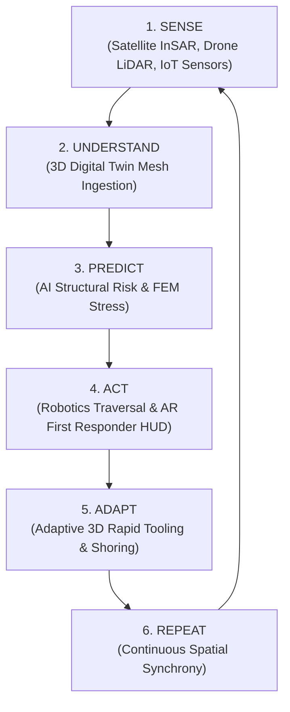

# 🚨 RESCUETWIN: Master Demonstration & Instruction Guide
### Autonomous Disaster Digital Twin for Intelligent Rescue Operations

---

## 📌 1. Project Concept & Pitch Summary

> 📊 **Canva Pitch Deck Link**: [https://canva.link/eq7jq85dahr7hj1](https://canva.link/eq7jq85dahr7hj1)  
> 🌐 **Live Web Application**: Built with React 19, Three.js (Fiber/Drei), TypeScript 5.9, Zustand, and Tailwind CSS.

### The Problem
During catastrophic natural disasters (earthquakes, structural collapses, secondary flash floods), first responders face lethal unknowns:
- **Blind Entry**: Teams enter structures without knowing if upper floors are about to pancake or if stairwells have collapsed.
- **Dynamic Hazards**: Rapid aftershocks, rising flood waters, and toxic gas leaks change safe corridors in seconds.
- **Uncoordinated Assets**: Drones, ground rovers, and sensor nodes operate in silos rather than feeding a unified spatial model.

### The Solution: RESCUETWIN
**RESCUETWIN** is an autonomous 3D Digital Twin Command Center that bridges real-world disaster zones with real-time spatial computing. It ingests multi-modal data from satellite radar, aerial LiDAR drones, ground rovers, and structural IoT sensors into a synchronized 3D model. When conditions change, its AI engine automatically evaluates structural risk, recalculates safe evacuation corridors, and triggers rapid 3D printing of shoring equipment.

---

## 🔄 2. The 6-Stage Autonomous Closed-Loop (How It Works)



$$\text{REAL-WORLD EVENT} \longrightarrow \text{DATA INGESTION} \longrightarrow \text{DIGITAL TWIN UPDATE} \longrightarrow \text{AI RISK EVALUATION} \longrightarrow \text{ROUTE RE-EVALUATION}$$

---

## ⚡ 3. The 7 Integrated Technologies Explained

| # | Technology | Sub-system & Telemetry | How It Works Under the Hood |
|---|---|---|---|
| **1** | **🛰️ Satellite Radar** | Sentinel-1 InSAR ($4.2\text{ mm/yr}$ deformation) | Measures centimeter-scale ground shift and regional flood inundation before drone deployment. |
| **2** | **🚁 Drone Recon** | Autonomous Quadcopter ($420\text{k pts/s}$ LiDAR) | Flies a continuous $360^\circ$ photogrammetry orbit, capturing high-density point clouds to generate real-time geometry of the collapse. |
| **3** | **📡 IoT Sensor Mesh** | 24 Multi-Modal Nodes ($4.8 \rightarrow 8.7\text{ mm/s}$ vibration) | Embedded tri-axial accelerometers, strain gauges, and gas sensors stream real-time MQTT packets detecting micro-fractures and resonance frequencies. |
| **4** | **🤖 Ground Robotics** | ROBOT-01 Tracked Rover ($37.2^\circ\text{C}$ FLIR Thermal) | Penetrates sub-basement voids where drones cannot fly; equipped with ironbow thermal imaging to detect living survivor heat signatures. |
| **5** | **🧠 AI Decision Engine** | Dynamic Dijkstra Multi-Factor Routing | Computes evacuation costs ($\text{Cost} = 0.8D + 2.2R + \text{Hazard Penalty}$), actively redirecting responders away from collapsing corridors. |
| **6** | **🥽 AR First Responder** | Spatial Heads-Up Display (HUD) | Projects tactical 3D waypoints, hazard zones, and survivor distance vectors directly into emergency personnel headsets. |
| **7** | **🖨️ 3D Rapid Tooling** | Mobile Additive Manufacturing ($100\%$ Complete) | 3D-prints custom carbon-fiber composite rebar spreaders and shoring braces mounted directly to the rover arm for structural stabilization. |

---

## 🎮 4. Complete Interactive Feature Map (What All Works)

### A. 3D Viewport Controls & Camera
- **360° Smooth Orbit**: Left-click and drag anywhere on the canvas to rotate around the disaster zone without any snapping.
- **Pan View**: Right-click (or two-finger drag) to pan the scene.
- **Zoom In / Zoom Out Slider HUD**: Bottom-right slider allows precision zooming between **$6\text{m}$ (close-up debris inspection)** and **$38\text{m}$ (macro site overview)** with real-time distance readouts.
- **Fullscreen 3D**: Top-right `FULLSCREEN 3D` button maximizes the viewport for clean command center presentations.
- **Preset Camera Angles**: Quick-switch buttons for `DEFAULT`, `TOP-DOWN (SATELLITE)`, `DRONE RECON`, `ROBOT VOID`, and `EAST WALL`.
- **Reset View**: Returns the camera instantly to the baseline $45^\circ$ isometric tactical view.

### B. Dynamic Object Selection & Smart 3D Labels
- **Default State**: Labels are kept **OFF** for a cinematic, uncluttered view.
- **Click-to-Inspect**: Clicking **ANY** 3D element in the scene highlights it and displays its tactical telemetry tag:
  - 🏢 **Building Slabs & Columns**: Shows structural integrity, floor level, and tilt angle.
  - 🚁 **Quadcopter Drone**: Shows altitude ($14.2\text{m}$), flight orbit, and LiDAR point count ($1.85\text{M pts}$).
  - 🤖 **Ground Rover**: Shows speed ($0.4\text{ m/s}$), battery ($88\%$), and FLIR thermal target detection ($37.2^\circ\text{C}$).
  - 📡 **Sensor Nodes (S-01 to S-06)**: Shows vibration (mm/s), strain ($\mu\varepsilon$), and status.
  - 🔲 **Hazard Zones (A, B, C, Survivor Void)**: Displays structural risk %, water depth, and survivor status.
  - 🛣️ **Rescue Splines (Routes A, B, C)**: Displays path distance, risk rating, and `OPTIMAL` vs `REJECTED` status.
- **Reactive Label Scaling**: Labels automatically adjust their scale relative to camera zoom distance so they are always crisp and readable.

### C. Live Tactical Picture-in-Picture (PiP) Stream
- Located in the bottom-left corner of the interface.
- **ROBOT-01 FLIR Thermal Feed**: Features an Ironbow false-color heatmap revealing the survivor's biometric heat signature ($37.2^\circ\text{C}$) trapped under rubble.
- **DRONE-01 Optical LiDAR Feed**: Shows aerial bird's-eye contours, altitude vectors, and laser point density.
- **Camera Controls**: Switch feeds, toggle crosshairs, and adjust optical magnification ($1\times, 2\times, 4\times$).

### D. Mission Timeline Scrubber ("Time Machine Playback")
- Drag the 0s–45s bottom slider to scrub backward and forward through the disaster lifecycle:
  - `00:00 INTACT`: Undamaged 5-storey building baseline.
  - `00:06 DRONE`: Autonomous drone takes off and scans the site.
  - `00:12 QUAKE`: Seismic shockwave buckles columns and fractures Floor 3–4 slabs.
  - `00:20 FLOOD`: Hydrodynamic flood wave surges $+1.85\text{m}$, scouring the foundation.
  - `00:28 ROBOT`: Rover penetrates basement void and pinpoints survivor.
  - `00:36 AR HUD`: AI recalculates optimal paths and projects AR overlays.
  - `00:42 PRINT`: 3D printer finishes carbon-fiber rebar tool.

### E. Tactical Telemetry Inspector Drawer (Right Sidebar)
Clicking the `INSPECTOR` button opens deep engineering analytics:
- 📈 **Time-Series Waveforms**: Live vibration velocity against the $6.5\text{ mm/s}$ failure threshold.
- ⚡ **FFT Spectrum Analysis**: Frequency domain chart identifying dangerous structural resonance peaks at $4.2\text{ Hz}$.
- 🏗️ **FEM Von Mises Stress**: Finite Element Method stress bars comparing current column load ($142\text{ MPa}$) vs safe design limit ($34\text{ MPa}$).
- 📜 **Raw MQTT Packet Stream**: Real-time JSON telemetry payloads arriving from edge nodes.

---

## 🎬 5. Step-by-Step Live Demonstration Script (3–5 Minute Walkthrough)

Follow this exact chronological script when demonstrating the prototype to a user, interviewer, or audience:

```
┌─────────────────────────────────────────────────────────────────────────────┐
│                       RESCUETWIN DEMONSTRATION WORKFLOW                     │
├──────────────┬───────────────────────────────┬──────────────────────────────┤
│ Timecode     │ User Action                   │ Speaking Prompt / Voiceover  │
├──────────────┼───────────────────────────────┼──────────────────────────────┤
│ Step 1 (0:00)│ Show Initial Screen           │ "Welcome to RESCUETWIN..."   │
│ Step 2 (0:30)│ Click 'Drone LiDAR Scan'      │ "First, we deploy aerial..." │
│ Step 3 (1:00)│ Click 'Sensor Spike' (Quake)  │ "At t=12s, an aftershock..." │
│ Step 4 (1:45)│ Open Inspector Drawer         │ "Looking at the FFT data..." │
│ Step 5 (2:15)│ Click 'Flash Flood Alert'     │ "Secondary flooding hits..." │
│ Step 6 (2:45)│ Click 'Robot Recon' + View PiP│ "ROBOT-01 finds survivor..." │
│ Step 7 (3:15)│ Click 'AI Path Recalculate'   │ "The AI recalculates cost..."│
│ Step 8 (3:45)│ Toggle 'AR Mode' & '3D Print' │ "AR HUD guides responders..."│
│ Step 9 (4:15)│ Scrub Time Slider & Orbit 360°│ "Let's review the timeline..."│
└──────────────┴───────────────────────────────┴──────────────────────────────┘
```

---

### 🎙️ Step-by-Step Presentation Script

#### 📍 Step 1: Baseline Intact State ($t = 0\text{s}$)
- **Action**: Load the application. Ensure the time slider is at `00:00`.
- **What to Say**:
  > *"This is RESCUETWIN, an autonomous 3D digital twin platform for intelligent disaster response. Right now, we are looking at our baseline intact facility. In the top telemetry bar, we see satellite InSAR coherence, normal baseline vibration at 1.2 mm/s, and a 100% structural integrity score. All 24 IoT mesh sensors and edge nodes are online."*

#### 📍 Step 2: Deploy Aerial Photogrammetry Scan ($t = 6\text{s}$)
- **Action**: Click the **`DRONE LIDAR SCAN`** trigger button on the top-left control panel (or scrub slider to `00:06`).
- **What to Say**:
  > *"Upon arriving at the disaster zone, our autonomous quadcopter drone initiates a 360-degree photogrammetric orbit. It captures 420,000 LiDAR points per second to generate an accurate 3D spatial map of the structure, visible in the blue scan cone."*

#### 📍 Step 3: Trigger Earthquake Shockwave ($t = 12\text{s}$)
- **Action**: Click the **`SENSOR SPIKE (QUAKE)`** trigger button (or scrub slider to `00:12`). Click on the collapsing building.
- **What to Say**:
  > *"Now, an earthquake aftershock hits the sector. Notice how our digital twin procedurally fractures in real time: structural columns buckle, Floor 3 and Floor 4 slabs break apart, North wall panels tumble, and internal rebar wires burst through the concrete. Structural integrity drops to 42%, and Zone A enters critical danger status."*

#### 📍 Step 4: Open Engineering Telemetry Inspector
- **Action**: Click the **`INSPECTOR`** toggle button on the top navigation bar.
- **What to Say**:
  > *"Opening the Inspector Drawer, we can see real-time physics telemetry: the time-series vibration has spiked past the 6.5 mm/s danger limit to 8.7 mm/s. The FFT spectrum shows a resonant frequency peak at 4.2 Hz, and the FEM Von Mises stress bar indicates columns are experiencing 142 MPa of stress—far exceeding the safe yield threshold."*

#### 📍 Step 5: Trigger Flash Flood Surge ($t = 20\text{s}$)
- **Action**: Click the **`FLASH FLOOD ALERT`** button (or scrub slider to `00:20`).
- **What to Say**:
  > *"Next, secondary flash flooding occurs. A hydrodynamic water surge of +1.85m floods the lower foundation at 3.4 m/s. The digital twin renders the rising water level and floating debris. Foundation scouring causes the lower structure to drop further, completely submerging Route C."*

#### 📍 Step 6: Deploy Ground Robot & Inspect Thermal PiP ($t = 28\text{s}$)
- **Action**: Click **`ROBOT RECON`** (or scrub slider to `00:28`). Look at the bottom-left PiP camera feed and switch to `ROBOT FLIR`.
- **What to Say**:
  > *"Because air drones cannot penetrate collapsed basements, we dispatch ROBOT-01, a tracked rover. In the bottom-left Picture-in-Picture camera feed, we see the ironbow FLIR thermal stream. The rover penetrates Basement Void B-2 and successfully detects a trapped survivor's biometric heat signature at 37.2°C."*

#### 📍 Step 7: AI Route Recalculation ($t = 34\text{s}$)
- **Action**: Click **`AI PATH RECALCULATE`** (or scrub slider to `00:34`). Click on the spline routes in the 3D scene.
- **What to Say**:
  > *"With the survivor located and hazards mapped, our AI Decision Engine evaluates evacuation routes using a multi-factor cost function:
  > - **Route A (North Direct)** is REJECTED due to heavy 76% structural collapse risk.
  > - **Route C (South Ground)** is REJECTED because it is submerged under 1.85m of flood water.
  > - **Route B (East Shear Wall Ramp)** is selected as the OPTIMAL RECOMMENDED path, providing a stable corridor for extraction."*

#### 📍 Step 8: AR Heads-Up Display & 3D Rapid Tooling ($t = 36\text{s} \rightarrow 42\text{s}$)
- **Action**: Click **`AR SPATIAL MODE`**, then click **`3D RAPID TOOLING`**.
- **What to Say**:
  > *"We activate AR Spatial Mode to project green waypoint corridors and danger bounding boxes directly onto first responder HUDs. Simultaneously, to stabilize the void opening, our mobile 3D printer manufactures a customized carbon-fiber rebar spreader tool, which mounts onto the rover's robotic manipulator arm."*

#### 📍 Step 9: Time Machine Scrubbing & Fullscreen 3D Overview
- **Action**: Drag the timeline slider back to `00:00` and scrub smoothly to `00:45`. Click `FULLSCREEN 3D` and use the zoom slider.
- **What to Say**:
  > *"Finally, commanders can use our interactive Time Machine scrubber to rewind and review every phase of the mission for post-incident debriefing, or enter Fullscreen 3D mode for macro spatial analysis. This completes the full autonomous sense-understand-predict-act closed loop."*

---

## 💡 6. Technical Interview FAQs & Core Formulas

### Q1: How does the AI Decision Engine compute route safety?
**Answer**: Route cost is computed dynamically using:
$$\text{Cost} = \alpha \cdot \text{Distance} + \beta \cdot \text{Risk}_{\text{structural}} + \gamma \cdot \text{Hazard}_{\text{penalty}}$$
- $\alpha = 0.8$ (Distance traversal weight)
- $\beta = 2.2$ (Structural vulnerability penalty weight)
- $\gamma = 100.0$ (Critical hazard penalty if risk $> 60\%$ or route is submerged)

### Q2: Why is the digital twin procedural instead of a static 3D model?
**Answer**: Real disaster scenes are non-static. Procedural geometry allows individual floor slabs, columns, walls, rebar elements, and water planes to translate, rotate, and buckle independently based on live MQTT sensor feeds and timeline keyframes.

### Q3: How are raycasts and clicks handled with transparent hazard volumes?
**Answer**: Volumetric hazard boxes use `raycast={() => null}` on their translucent interior meshes to prevent blocking click events to the building, drone, rover, and sensor nodes underneath. Click detection is cleanly anchored to the footprint rings, edges, and object collision bounding boxes.

---

## 🎯 7. Quick Reference Checklist Before Your Presentation

- [x] **Browser**: Chrome, Edge, or Brave with WebGL 2.0 enabled.
- [x] **Local URL**: `http://localhost:5173` or your live Vercel URL.
- [x] **Audio**: Unmute system sound to hear procedural tactical audio tones.
- [x] **Canva Deck Tab**: Have [https://canva.link/eq7jq85dahr7hj1](https://canva.link/eq7jq85dahr7hj1) open in an adjacent tab.
- [x] **Fullscreen**: Press `FULLSCREEN 3D` or `F11` for a clean presentation screen.
