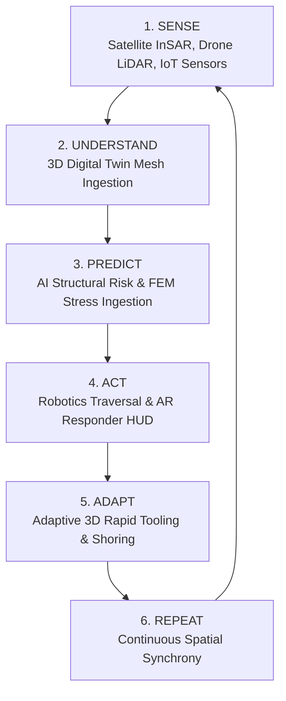

# 🚨 RESCUETWIN
### Autonomous Disaster Digital Twin for Intelligent Rescue Operations

[](https://vercel.com/new/clone?repository-url=https%3A%2F%2Fgithub.com%2FRajkishore08%2FRescuetwin_ARCSS)
[](https://canva.link/eq7jq85dahr7hj1)
[](https://www.typescriptlang.org/)
[](https://reactjs.org/)
[](https://threejs.org/)
[](https://vitejs.dev/)

---

## 🎨 Project Concept & Pitch Presentation

> 📊 **Explore the Full Project Pitch & Idea Deck on Canva:**  
> **👉 [View RescueTwin Pitch Deck](https://canva.link/eq7jq85dahr7hj1)**

---

## 📌 Executive Summary

Disaster environments are dynamic, chaotic, and continuously degrading. First responders navigating partially collapsed structures face catastrophic secondary collapses, flash flooding, and toxic gas pockets.

**RESCUETWIN** is an industry-grade, autonomous 3D digital twin platform designed for aerospace, robotics, and emergency command centers. It synthesizes multi-modal data from **Satellite SAR**, **Autonomous Drones**, **IoT Sensor Meshes**, and **Ground Rovers** to continuously evaluate structural risk, dynamically recalculate safe evacuation routes, and execute adaptive 3D rapid tooling.

---

## 🔄 Core Closed-Loop Engine

RESCUETWIN operates on a continuous, 6-stage autonomous closed-loop cycle:



$$\text{REAL-WORLD EVENT} \longrightarrow \text{DATA INGESTION} \longrightarrow \text{DIGITAL TWIN UPDATE} \longrightarrow \text{AI RISK EVALUATION} \longrightarrow \text{ROUTE RE-EVALUATION}$$

---

## ⚡ 7 Core Integrated Technologies

| Technology | Sub-system | Live Telemetry & Mission Role |
|---|---|---|
| **1. 🛰️ Satellite** | Sentinel-1 InSAR | Surface coherence deformation maps ($4.2\text{ mm/yr}$) & 0.3m optical terrain mapping |
| **2. 🚁 Drone Recon** | Autonomous Quadcopter | $360^\circ$ aerial photogrammetry & continuous LiDAR point-cloud generation ($420\text{k pts/s}$) |
| **3. 📡 IoT Mesh** | Structural Sensor Network | 24 multi-modal nodes monitoring vibration (mm/s), displacement (cm), temperature (°C), and gas (ppm) |
| **4. 🤖 Ground Robotics** | ROBOT-01 Tracked Rover | Sub-basement void exploration, debris clearance, and biometric FLIR thermal survivor detection ($37.2^\circ\text{C}$) |
| **5. 🧠 AI Decision Engine** | Multi-Factor Risk Inference | Mathematical risk decomposition ($0\% \rightarrow 100\%$) and cost-optimized Dijkstra path evaluation |
| **6. 🥽 AR Responder** | Spatial Heads-Up Display | Heads-up waypoint vectors, danger bounding boxes, and low-latency tactical overlay |
| **7. 🖨️ 3D Printing** | Rapid Additive Tooling | On-demand carbon-fiber rebar spreader fabrication ($0\% \rightarrow 100\%$) mounted directly to rover arm |

---

## 🌟 Key Features & Architectural Capabilities

### 1. 🏗️ Procedural Piece-by-Piece Building Collapse
- **Intact Baseline ($t = 0\text{s}$)**: Normal, structurally sound 5-storey building (100% integrity, clean floor slabs, aligned columns, unbroken bridge).
- **Earthquake Shockwave ($t = 12\text{s}$)**: Progressively ramps vibration from $4.8 \rightarrow 8.7\text{ mm/s}$; structural columns buckle, Floor 3 & 4 slabs fracture and drop, North wall panels tumble, and rebar wires burst out piece-by-piece.
- **Flash Flood Inundation ($t = 20\text{s}$)**: Hydrodynamic flood surge ($+1.85\text{m}$ at $3.4\text{ m/s}$); foundation scours, collapsing lower structures down to the ground with floating debris and animated foam spray particles.

### 2. ⏱️ Interactive Mission Timeline Scrubber ("Time Machine Playback")
- Drag the bottom time slider across the mission duration ($t = \text{00:00} \rightarrow \text{00:45}$) to smoothly scrub backward and forward in time, watching the digital twin break down, flood, re-route, and reconstruct in real time.
- Milestone quick-jump keyframe pills: `00:00 INTACT`, `00:06 DRONE`, `00:12 QUAKE`, `00:20 FLOOD`, `00:28 ROBOT`, `00:36 AR HUD`, `00:42 PRINT`.

### 3. 📹 Picture-in-Picture (PiP) Live Tactical FPV Camera
- **ROBOT-01 FLIR Thermal Feed**: Ironbow false-color heatmap showing the $37.2^\circ\text{C}$ biometric survivor signature glowing through basement concrete rubble.
- **DRONE-01 Optical LiDAR Feed**: Aerial bird's-eye stream with wireframe depth contours, tracking bounding boxes, and altitude readouts.
- Full tactical HUD: artificial horizon pitch/roll indicators, RF link telemetry, and zoom selector ($1\times, 2\times, 4\times$).

### 4. 🔲 Fullscreen 3D Viewport & Dedicated Zoom Slider
- Single-click `FULLSCREEN 3D` mode for immersive presentations.
- Dedicated Zoom In / Zoom Out slider HUD with precision distance readouts ($6\text{m} \rightarrow 38\text{m}$) and smooth 360° orbital rotation.

### 5. 🔍 Tactical Telemetry Inspector Drawer
- **Time-Series Graph**: Real-time signal waveforms with critical thresholds (6.5 mm/s limit).
- **FFT Spectrum**: Frequency-domain analysis identifying structural resonance peaks (4.2 Hz).
- **FEM Stress**: Finite Element Method Von Mises yield stress bars (142 MPa yield exceeded vs. 34 MPa safe margin).
- **MQTT Logs**: Chronological raw JSON payload packets streaming from edge brokers.

---

## 📐 AI Risk & Route Cost Formulation

The AI Decision Engine computes route traversal cost dynamically using the multi-factor objective function:

$$\text{Cost} = \alpha \cdot \text{Distance} + \beta \cdot \text{Risk}_{\text{structural}} + \gamma \cdot \text{Hazard}_{\text{penalty}}$$

Where:
- $\alpha = 0.8$ (Distance weight)
- $\beta = 2.2$ (Structural vulnerability penalty)
- $\gamma = 100.0$ (Critical hazard multiplier if risk $> 60\%$ or route flooded)

### Real-Time Route Decision Matrix:
* **Route A (North direct corridor, 28m)**: $\text{Risk} = 76\% \implies \text{Cost} = 189.6 \implies \mathbf{REJECTED}$ (Structural collapse hazard).
* **Route B (East shear wall safe ramp, 41m)**: $\text{Risk} = 29\% \implies \text{Cost} = 96.6 \implies \mathbf{RECOMMENDED}$ (Optimal verified corridor).
* **Route C (South ground gantry, 52m)**: $\text{Risk} = 92\% \implies \text{Cost} = 244.0 \implies \mathbf{REJECTED}$ (Submerged by flash flood).

---

## 💻 Tech Stack

- **Framework**: [React 19](https://react.dev/) + [TypeScript 5.9](https://www.typescriptlang.org/)
- **3D Graphics Engine**: [Three.js r182](https://threejs.org/) + [@react-three/fiber](https://docs.pmnd.rs/react-three-fiber) + [@react-three/drei](https://github.com/pmndrs/drei)
- **State Machine**: [Zustand](https://github.com/pmndrs/zustand)
- **Styling**: [Tailwind CSS v4](https://tailwindcss.com/)
- **Audio Synthesizer**: Web Audio API Procedural Synthesizer
- **Icons**: [Lucide React](https://lucide.dev/)
- **Build Tool**: [Vite 8](https://vitejs.dev/)

---

## 🚀 Quickstart & Local Setup

### Prerequisites
- Node.js (v18 or higher)
- npm or pnpm

### Installation

```bash
# Clone the repository
git clone https://github.com/Rajkishore08/Rescuetwin_ARCSS.git
cd Rescuetwin_ARCSS

# Install dependencies
npm install

# Start local development server
npm run dev
```

Open [http://localhost:5173](http://localhost:5173) in your browser.

### Production Build

```bash
npm run build
npm run preview
```

---

## 🌐 Deploy to Vercel

1. Push your repository to GitHub.
2. Go to [vercel.com/new](https://vercel.com/new) and import `Rescuetwin_ARCSS`.
3. Vercel automatically detects Vite settings:
   - **Framework Preset**: `Vite`
   - **Build Command**: `npm run build`
   - **Output Directory**: `dist`
4. Click **Deploy**.

---

## 📄 License

Distributed under the MIT License. See `LICENSE` for more information.

Developed by **Raj Kishore** for Autonomous Disaster Operations & Intelligent Digital Twin Systems.
